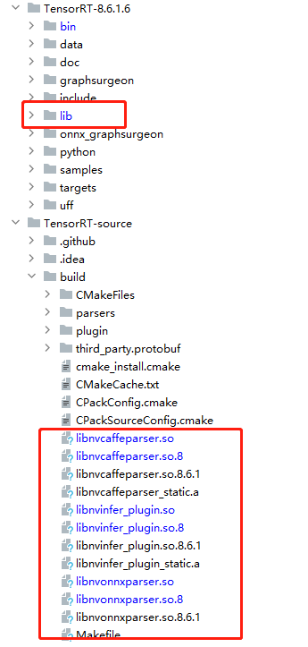

# Correlation_and_GridSamper_Plugin_TensorRT
Implementation of Correlation Operator and GridSampler Operator on TensorRT 8.

Correlation算子和GridSampler算子在TensorRT8上的实现.

Copy the files in Plugin to the Plugin file in the TensorRT source library for compilation, and copy the files generated in build to the lib folder in the TensorRT inference library for replacement.

将Plugin中的文件复制到TensorRT源码库的Plugin文件中编译，将build中生成的文件复制到TensorRT推理库中的lib文件夹内进行替换.

Make model modifications to ONNX before transitioning to TRT.

在ONNX转TRT之前先对ONNX进行模型修改.(https://github.com/ReggieBird/Correlation_and_GridSamper_Plugin_TensorRT/tree/main/ModifyOnnx).

Reference and modification from (https://github.com/ltkong218/FastFlowNet).
